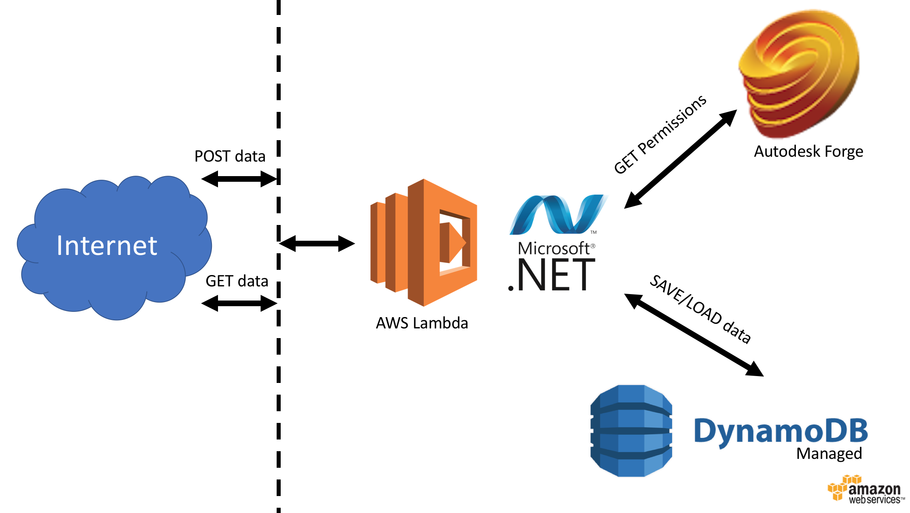
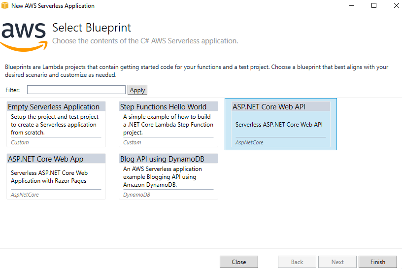

# custom.attribute.database-lambda.dynamodb


[](http://opensource.org/licenses/MIT)

[](http://developer.autodesk.com/)


This sample implements a database to store attributes indexed by Viewer (or Model Derivative) URN, hooking into the same permission settings.

# Server-Side

The server side was implemented in .NET and exposes 3 endpoints:

  1. POST `/api/attributes`: Create a new database entry for the given URN. The body should be in the format of:

  ```JSON
  {
      "urn":"dXJuOmFkc2WXlUUXNPd1E",
      "attribute":"some information"
  } 
  ```
     
  2. PUT `/api/attributes/:urn`: Update the database entry for the give URN. The body should be in the format of:

  ```JSON
  {
      "urn":"dXJuOmFkc2WXlUUXNPd1E",
      "attribute":"updated information"
  } 
  ```
     
  3. GET `/api/attributes/:urn`: Returns the database record

#### Authorization

All endpoints require a `Authorization` header with a valid Autodesk Forge access token (`Bearer <<access token>>`). 

## AWS Architecture

This sample uses **AWS Lambda** on-demand compute to react to incoming calls. First it connects to Autodesk Forge to check for permissions for the given `URN`. Then connects to **Amazon DynamoDB** to `Save` or `Load` the attributes.



### AWS Lambda

There are different options to create a .NET project for AWS Lambda. This sample uses the **ASP.NET Core Web API**, which is compatible with existing Web API apps, easier to migrate from existing apps. To create a new project, select the following blue print.



### Amazon DynamoDB

A table is required for this sample. The code creates it on demand, but make sure to allow the required permissions. Review the provisioned read & write capacity to adjust to your needs. 

The [DynamoDBContext](https://docs.aws.amazon.com/pt_br/amazondynamodb/latest/developerguide/DotNetDynamoDBContext.html) SDK class will take care of `Save` and `Load` documents into the [Model.Attributes](blob/master/CustomAttributes/CustomAttributes/Model/Attributes.cs) class. To edit what is saved, change the properties of this class.

### Other services used:

 - **Amazon API Gateway**: Receive incomming requests and redirect to the Lambda function
 - **Amazon S3**: The .NET package is deployed and server from a bucket
 - **AWS CloudFormation**: The selected blueprint will define a **Stack** that can easily maintained.

# Setup

To use this sample, make sure to edit the **AWS Profile** and **Region** at [this file](blob/master/CustomAttributes/CustomAttributes/aws-lambda-tools-defaults.json).

The [AWS Toolkit for Visual Studio](https://aws.amazon.com/visualstudio/) is a must have tool for .NET developers. With that, the "*Publish to AWS Lambda*" toolkit feature will take care of compiling the code, uploading to S3 and triggering the CloudFormation. 

## License

This sample is licensed under the terms of the [MIT License](http://opensource.org/licenses/MIT). Please see the [LICENSE](LICENSE) file for full details.

## Author

Forge Partner Development Team

- Augusto Goncalves [@augustomaia](https://twitter.com/augustomaia)

See more at [Forge blog](https://forge.autodesk.com/blog).